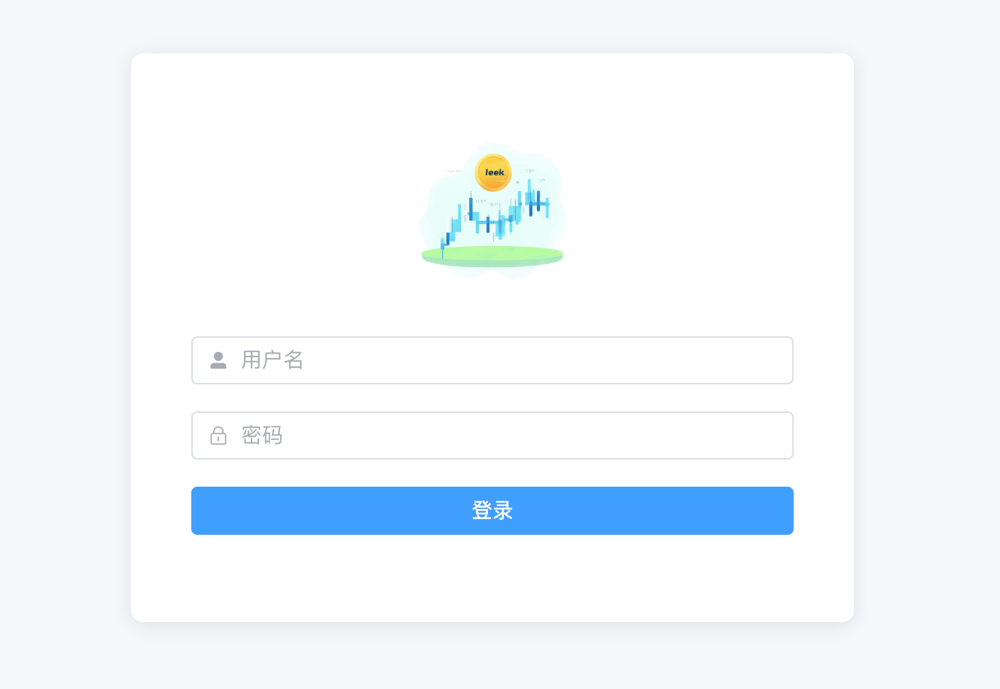
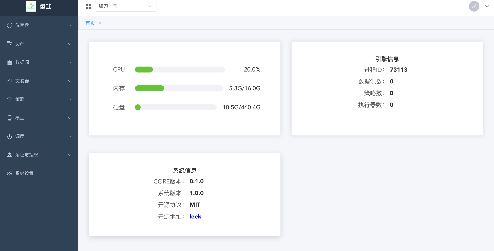
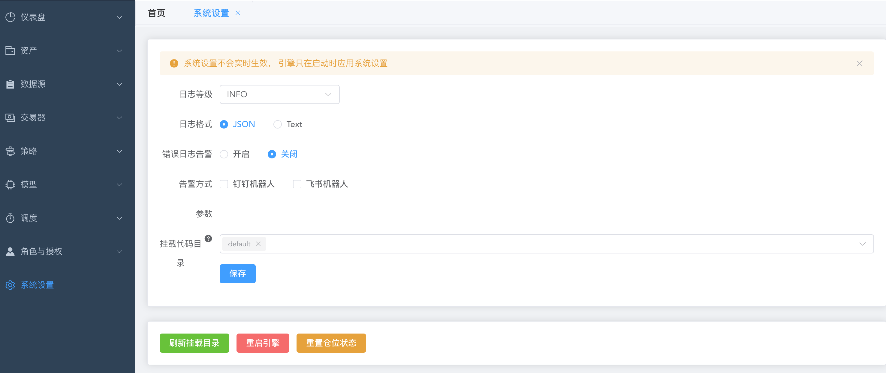
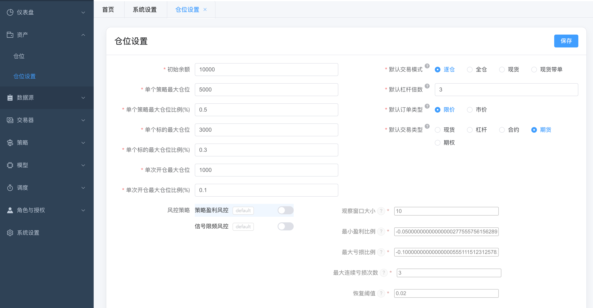
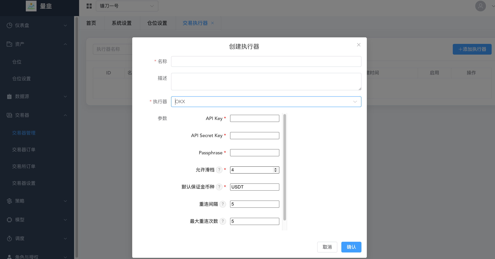
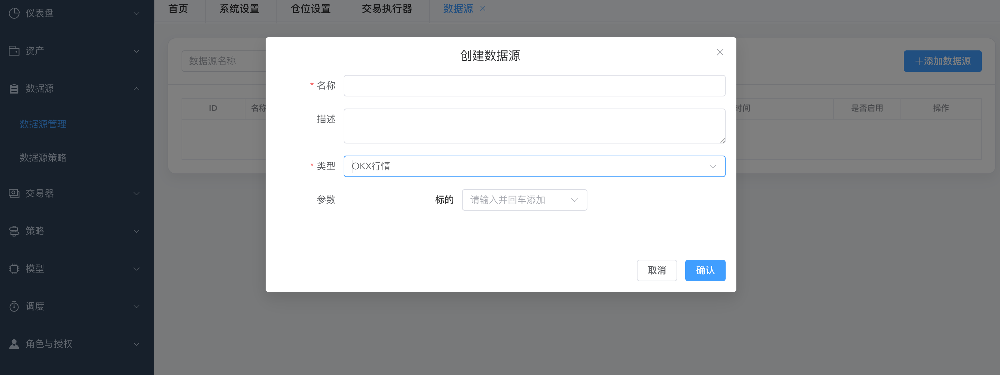
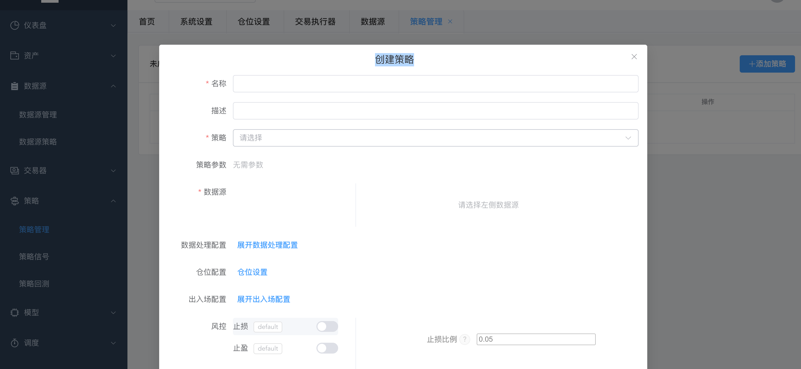
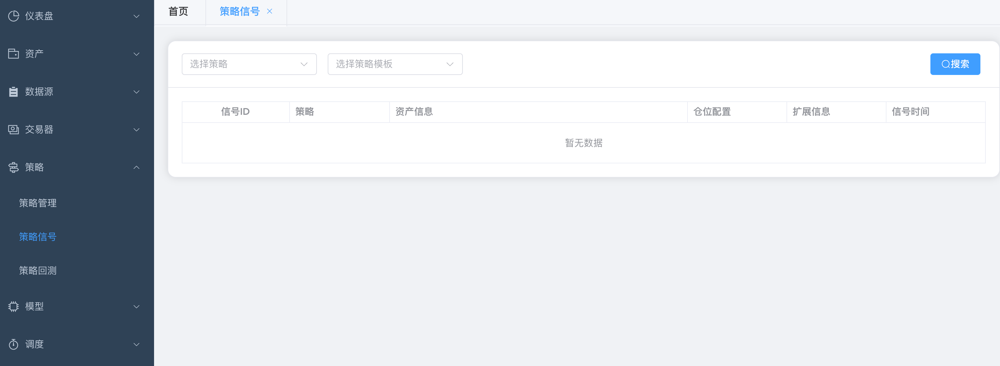
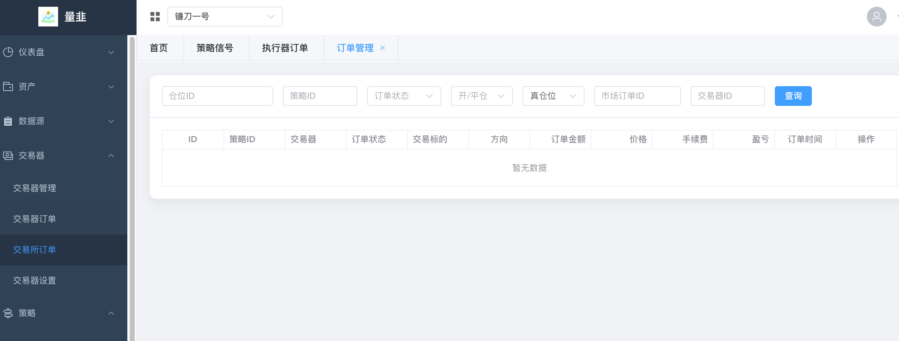

# Leek Manager

量化交易管理系统 - 后端服务

## 功能特性

- 策略管理
- 数据源管理
- 执行器管理
- 风险管理
- 用户权限管理
- 项目管理
- 仓位管理
- 信号管理
- 订单管理

## 技术栈

- FastAPI
- SQLAlchemy
- Alembic
- MySQL
- Python 3.11+
- Poetry

## 系统截图

> 📸 **截图说明**：以下截图展示了系统的主要功能界面，帮助用户快速了解系统操作流程。

### 登录界面

*系统登录页面，支持用户名密码登录*

### 主控制台

*系统主控制台，显示关键指标和快速操作入口*

### 项目管理

*项目管理界面，支持创建、编辑、删除项目*

### 项目设置

*项目详细配置页面，包括风险控制、交易时间等设置*

### 仓位管理

*仓位配置界面，设置最大仓位、止损止盈等参数*

### 交易器配置

*交易执行器配置页面，设置交易所API和账户信息*

### 数据源管理

*数据源配置界面，支持OKX、ClickHouse等多种数据源*

### 策略管理

*策略管理界面，支持策略上传、配置和运行控制*

### 信号监控

*交易信号监控页面，实时显示策略产生的信号*

### 订单管理

*订单管理界面，查看订单状态和历史记录*

### 风险管理

*风险管理面板，实时监控风险指标和预警*

### API文档

*系统API文档页面，提供完整的接口说明*


## 使用指南

### 1. 登录系统

1. 访问 API 文档页面：http://localhost:8000/docs
2. 使用 `/api/v1/auth/login` 接口进行登录
3. 获取访问令牌 (Access Token)


### 2. 创建项目

1. 使用 `/api/v1/projects/` 接口创建新项目
2. 设置项目基本信息：
   - 项目名称
   - 项目描述
   - 交易品种
   - 初始资金

### 3. 项目设置

1. 配置项目参数：
   - 风险控制参数
   - 交易时间设置
   - 手续费率设置
2. 设置项目状态（启用/禁用）

### 4. 仓位设置

1. 使用 `/api/v1/position/` 接口配置仓位管理
2. 设置仓位参数：
   - 最大仓位比例
   - 单笔交易限额
   - 止损止盈设置
   - 仓位计算方式

### 5. 交易器配置

1. 使用 `/api/v1/executors/` 接口配置交易执行器
2. 设置执行器参数：
   - 交易所配置（API Key、Secret）
   - 交易账户信息
   - 执行策略设置
   - 风控参数

### 6. 数据源配置

1. 使用 `/api/v1/datasources/` 接口配置数据源
2. 支持的数据源类型：
   - OKX WebSocket
   - ClickHouse
   - 其他自定义数据源
3. 配置数据源连接参数

### 7. 策略管理

1. 使用 `/api/v1/strategies/` 接口管理交易策略
2. 策略操作：
   - 创建新策略
   - 上传策略文件
   - 配置策略参数
   - 启动/停止策略
   - 查看策略运行状态

### 8. 信号管理

1. 使用 `/api/v1/signal/` 接口管理交易信号
2. 功能包括：
   - 查看策略产生的信号
   - 手动确认/拒绝信号
   - 信号历史记录
   - 信号统计分析

### 9. 订单管理

1. 使用 `/api/v1/order/` 接口管理交易订单
2. 功能包括：
   - 查看订单状态
   - 订单历史记录
   - 订单统计分析
   - 手动下单

### 10. 风险管理

1. 实时监控风险指标
2. 设置风险预警
3. 查看风险报告
4. 紧急停止功能

## API 文档

启动服务后，访问以下地址查看完整的 API 文档：

- Swagger UI：http://localhost:8000/docs
- ReDoc：http://localhost:8000/redoc

## 开发指南

### 项目结构

```
leek-manager/
├── app/
│   ├── api/           # API 路由
│   ├── core/          # 核心配置
│   ├── db/            # 数据库相关
│   ├── models/        # 数据模型
│   ├── schemas/       # 数据模式
│   └── utils/         # 工具函数
├── migrations/        # 数据库迁移文件
├── img/              # 系统截图目录
│   ├── 01-login.png
│   ├── 02-dashboard.png
│   ├── 03-project-management.png
│   ├── 04-project-settings.png
│   ├── 05-position-management.png
│   ├── 06-executor-config.png
│   ├── 07-datasource-management.png
│   ├── 08-strategy-management.png
│   ├── 09-signal-monitoring.png
│   ├── 10-order-management.png
│   ├── 11-risk-management.png
│   └── 12-api-docs.png
└── tests/            # 测试文件
```

## 部署

### Docker 部署

```dockerfile
FROM python:3.11-slim

WORKDIR /app

# 安装 Poetry
RUN pip install poetry

# 复制项目文件
COPY pyproject.toml poetry.lock ./
COPY app ./app
COPY migrations ./migrations

# 安装依赖
RUN poetry config virtualenvs.create false
RUN poetry install --no-dev

# 暴露端口
EXPOSE 8000

# 启动命令
CMD ["uvicorn", "app.main:app", "--host", "0.0.0.0", "--port", "8000"]
```

### 生产环境配置

1. 修改 `.env` 文件中的生产环境配置
2. 使用强密码和安全的 SECRET_KEY
3. 配置 HTTPS
4. 设置适当的 CORS 策略
5. 配置日志记录
6. 设置监控和告警

## 常见问题

### Q: 数据库连接失败
A: 检查 DATABASE_URL 配置是否正确，确保 MySQL 服务正在运行

### Q: 依赖安装失败
A: 确保使用 Python 3.11+ 版本，并正确安装 Poetry

### Q: 迁移失败
A: 检查数据库权限，确保用户有创建表的权限

## 贡献指南

1. Fork 项目
2. 创建功能分支
3. 提交更改
4. 推送到分支
5. 创建 Pull Request

## 许可证

MIT License

## 联系方式

- 讨论组：<a href="https://t.me/+lFHR-vTZ6Y1iZTU1">Telegram</a>
- 项目地址：https://github.com/shenglin-li/leek 